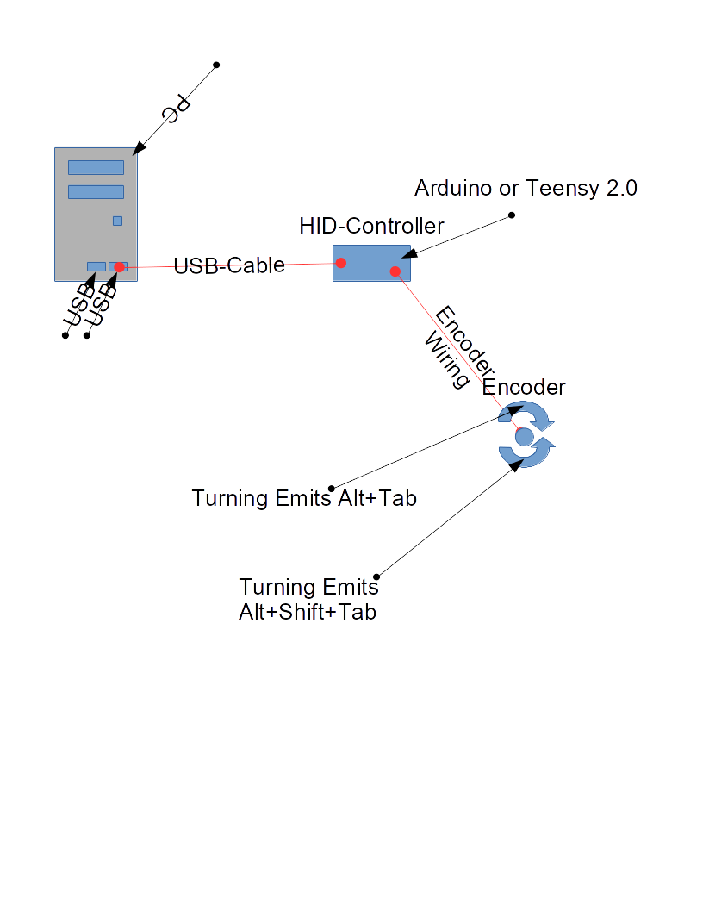

# Alt-Tab-Hardware-Switch

## Idea

Alt-Tab-Hardware-Switch is an idea of an extension to common keyboards.

The basic idea is to build a little unit which consists of an encoder (https://en.wikipedia.org/wiki/Rotary_encoder#Incremental_rotary_encoder, https://de.wikipedia.org/wiki/Inkrementalgeber) and an usb HID controller.

The HID-Controller emits Alt-Tab and Alt-Shift-Tab key strokes whenever the encoder gets turned by one position (counter clockwise: `Alt-Shift-Tab`, clockwise: `Alt-Tab`) 

## Possible solutions for the controllers:

* Teensy 2.0 https://www.pjrc.com/teensy/
* Arduino MKR ZERO https://store.arduino.cc/arduino-mkrzero

## Possible solutions for the encoder:

* TT Electronics AB 1EN11-HSM1AF15 https://www.conrad.at/de/encoder-5-vdc-001-a-schaltpositionen-20-360-tt-electronics-ab-1en11-hsm1af15-1-st-453405.html?sc.ref=Product%20Details

## Chart

## Further Reading 

* Arduino Keyboard.write() https://www.arduino.cc/en/Reference/KeyboardWrite
* Cubiq-org a blog post with the title "Build your very own PC keyboard" http://cubiq.org/build-your-very-own-pc-keyboard
* PJRC Teensy 2.0 Keyboard Project https://www.pjrc.com/teensy/usb_keyboard.html
* PJRC Teensyduino (Software) https://www.pjrc.com/teensy/td_download.html
* TMK Library for the Teensy 2.0 (Github) https://github.com/tmk/tmk_keyboard
* TMK one key project for the Teensy 2.0 (Github) https://github.com/tmk/tmk_keyboard/tree/master/keyboard/onekey